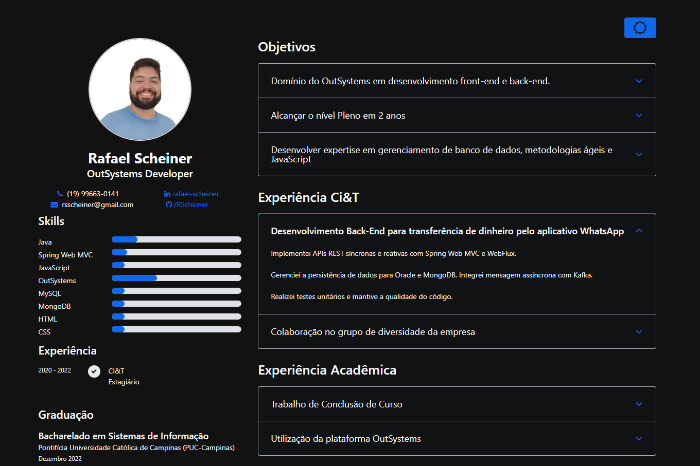

# OutSystemsWebCurriculum
Explore my professional journey and skills with this interactive Reactive Web App showcasing my curriculum vitae. This app provides a dynamic and user-friendly experience, allowing you to navigate through my education, work history, and key accomplishments in an engaging format.

**How to Use:**
Visit the app URL to interact with my curriculum. Explore different sections, hover over project details, and get a comprehensive overview of my qualifications.

**Future Updates:**
No exoected new features to be developed, might only do minor UI changes

**App URL:**
[Visit My Reactive Web App Curriculum](./AppURL.txt)

**ScreenShots:**

**Updates:**

29/01/24 - Darkmode Added

31/01/24 - Language Selector(Portuguese/English) and translation done

**Feedback and Contributions:**
I welcome your feedback! Feel free to open issues for suggestions or contribute to the improvement of this web app.
