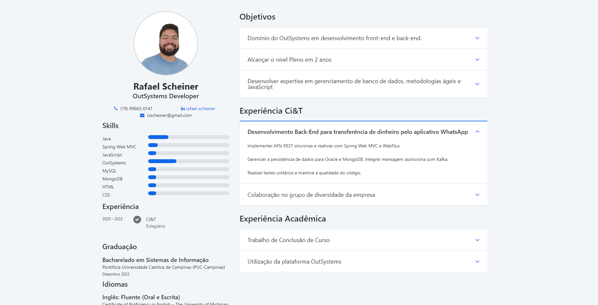
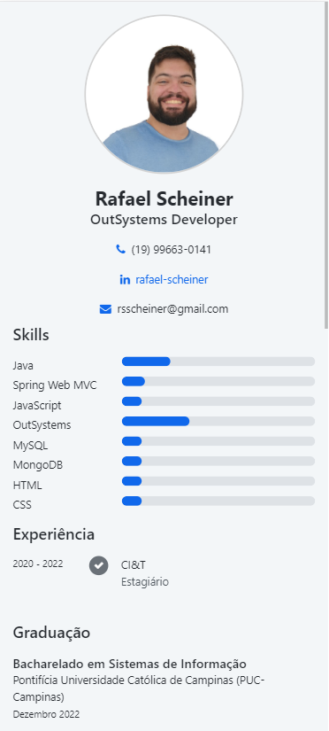

# OutSystemsWebCurriculum
Explore my professional journey and skills with this interactive Reactive Web App showcasing my curriculum vitae. This app provides a dynamic and user-friendly experience, allowing you to navigate through my education, work history, and key accomplishments in an engaging format.

**How to Use:**
Visit the app URL to interact with my curriculum. Explore different sections, hover over project details, and get a comprehensive overview of my qualifications.

**Future Updates:**
Currently it is only available in portuguese and in light mode, I will come back to it to add a change language option to display either portuguese or english, and an option to turn it dark mode

**App URL:**
[Visit My Reactive Web App Curriculum](./AppURL.txt)

**ScreenShots:**

**Feedback and Contributions:**
I welcome your feedback! Feel free to open issues for suggestions or contribute to the improvement of this web app.
